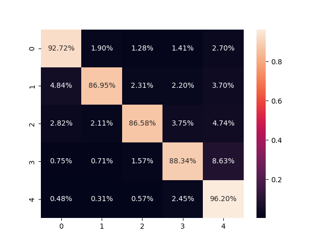

# Score_Prediction_using_Pyspark
- In this repo a Score Prediction system will be built using Pyspark.

## Content
- [Prerequisites](#prerequisites)
- [Installation](#installation)
- [Structure](#structure)
- [Preprocessing](#preprocessing)
- [Training](#training)
- [Evaluation](#evaluation)
- [Prediction](#prediction)

## Prerequisites
- Ubuntu >= 18.04
- Python > 3.8
- Anaconda3

## Installation
- To setup and activate a conda environment with our needed libraries.
- We will call our environment pyspark, you can use any desired name.
- To do this follow the next steps:
```
conda create -n pyspark python=3.9 -y
conda activate pyspark
conda install openjdk pyspark scikit-learn scipy matplotlib seaborn -y
sudo apt-get install sqlite3
```

## Structure
- [train.py](train.py): Used to load a given SQL database, train a logistic regression classifier using it, then evaluate the model, where its parameters are:            
`sql_database_file`: Containing the SQL database file path.                   
`csv_file`: Containing the path to dump the CSV database file version in.                  
`model_path`: Containing the directory to export the trained model to.                  

- [test.py](test.py): Used to load a given SQL database, then predict their scores, where its parameters are:                    
`sql_database_file`: Containing the SQL database file path.               
`csv_file`: Containing the path to dump the CSV database file version in.                
`model_path`: Containing the directory where the trained model will be exported.                
`output_csv_file`: Containing the path where the output CSV file with the model predictions will be exported.              

## Preprocessing
- The Amazon review SQL database file was used for our training and evaluation.
- Before training the model any unwanted features were excluded.
- Any Null rows were removed.
- All columns were casted to either string or float types based on their content.
- Any rows with `HelpfulnessNumerator` less than or equal to zero were excluded.
- The desired features were `Summary` and `Text`.
- They were concatenated into one column, tokenized, cleaned of stop words, then vectorized.
- All these steps can be found with their in-code documentation in [train.py](train.py).

## Training
- Using the preprocessed data a logistic regression model was trained.
- This model predicts the score based on its input data.

## Evaluation
- The dataset was split into 75% train set and 25% test set to evaluate the model on.
- Using the created test set the model got the following results:              

|  | **Precision** | **Recall** | **F1-score** | **Support** |
| ------ | ------ | ------ | ------ | ------ | 
| 1.0 | 0.93 | 0.93 | 0.93 | 7828 |
| 2.0 | 0.88 | 0.87 | 0.87 | 3593 |
| 3.0 | 0.88 | 0.87 | 0.87 | 4745 |
| 4.0 | 0.85 | 0.88 | 0.86 | 8489 |
| 5.0 | 0.97 | 0.96 | 0.96 | 40831 |
| **Accuracy** | 0.94 | 0.94 | 0.94 | 65486 |
| **Macro-Avg** | 0.91 | 0.91 | 0.91 | 65486 |
| **Weighted-Avg** | 0.94 | 0.94 | 0.94 | 65486 |
- **Confusion matrix**:                        

- Due to the random splitting the test set isn't balanced, so we will mainly look at the macro average F1-score which isn't affected by the classes imbalance.          
- As shown in the results table our macro-average F1-score is 90% which is still a good and acceptable result.

## Prediction
- To predict new scores given a database file use [test.py](test.py), where it will read the SQL database file and produce the predictions with their indices in a CSV file.
- Any new test set will be cleaned and the same preprocessing will be done to it except for removing any rows based on the `HelpfulnessNumerator`.
- Due to these preprocessing steps some rows may be droped, for example:
  - If we used our available training SQL database as a test set 10 rows will be droped from the 568455 available rows.
- All the predictions in the output file will contain their indices to distinguish them, and if any index was missing it means it was droped due to it containing wrong datatype or Nulls.


